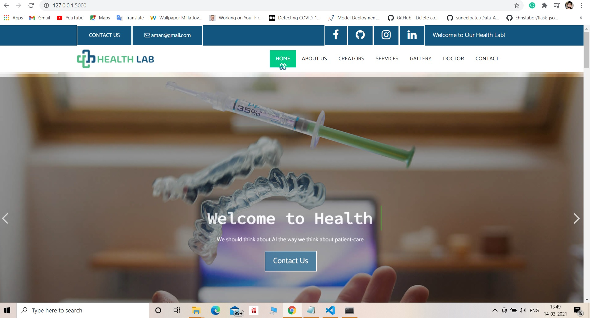
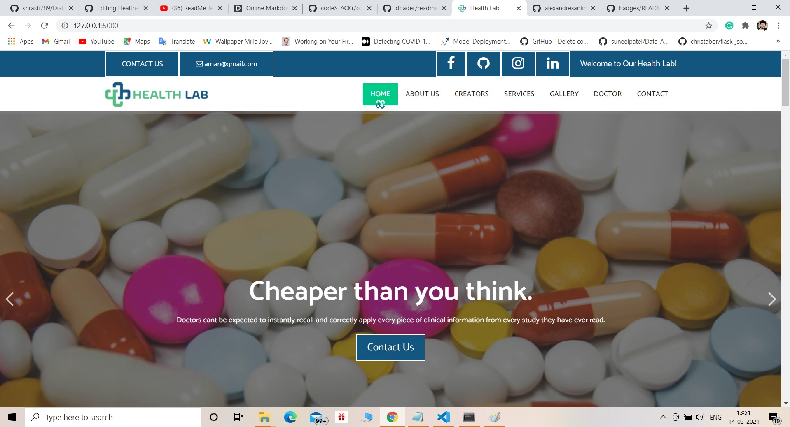
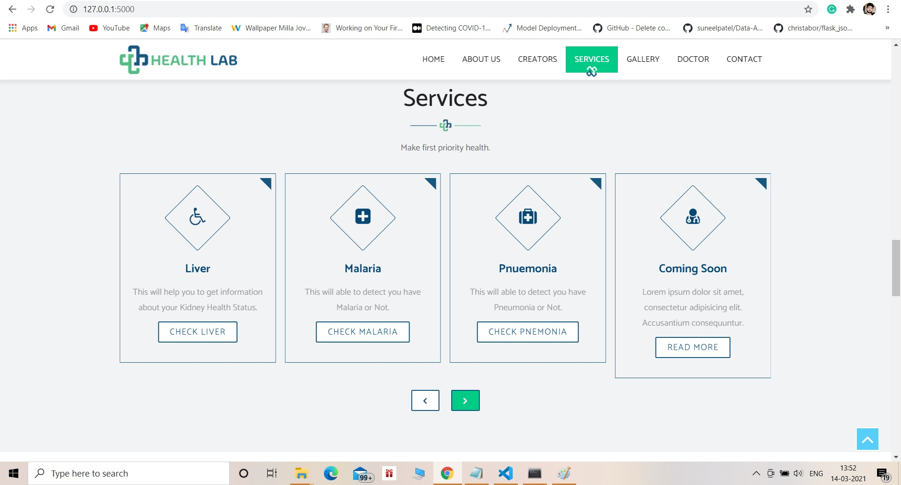
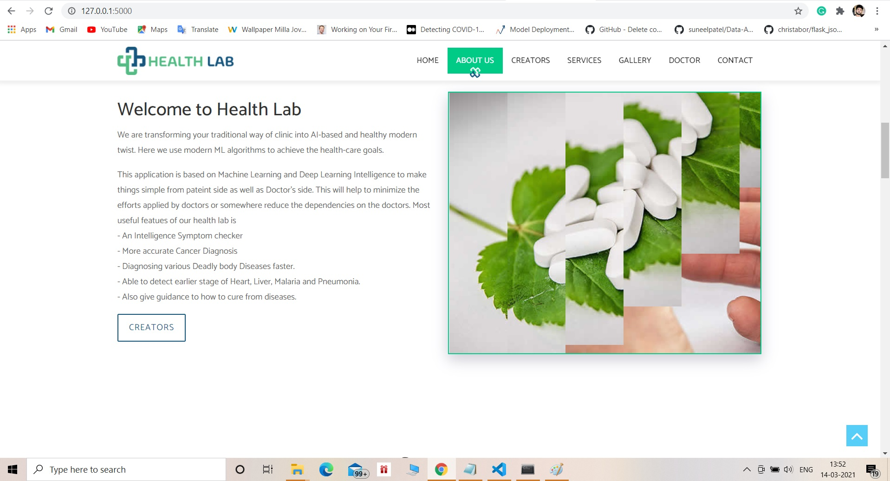
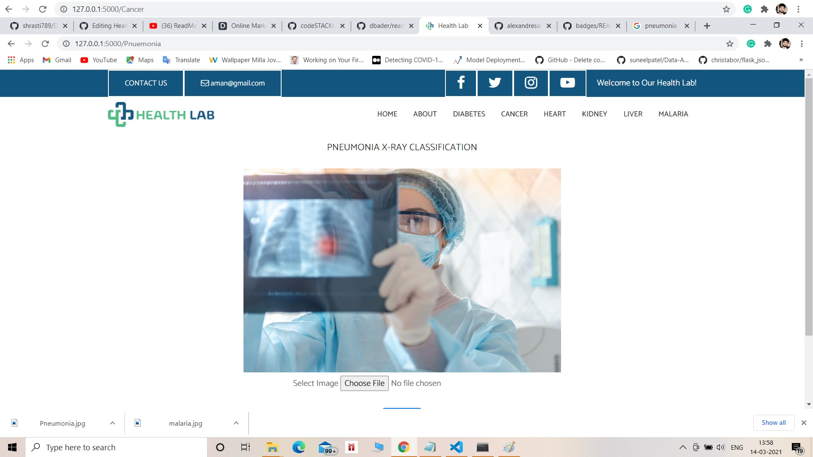
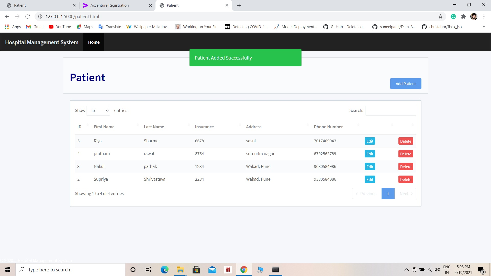

# Tech-Health-lab
## _Our Mission to make clinical facilities more efficient.

<a target="_blank" href="www.linkedin.com/in/aman-sharma-01b185190/">
  
</a>  <a target="_blank" href="https://www.instagram.com/aman___sharma/">
  </a>  <a target="_blank" href="mailto:aman.sharmatds1999@gmail.com"> 
  
</a>  <a target="_blank" href="https://portfolioaman.herokuapp.com/">
  
</a>  
<br>
<br>

   

## Datasets 
[Malaria](https://www.kaggle.com/iarunava/cell-images-for-detecting-malaria) <br>
[Pneumonia](https://www.kaggle.com/paultimothymooney/chest-xray-pneumonia)


## Table of Content
  * [Overview](#Overview)
  * [Motivation](#Motivation)
  * [Features](#Features)
  * [Samples Pictures or Demo](#Samples-Pictures-or-Demo)
  * [Installation and run](#Installation-and-run)
  * [Contributing](#Contributing)
  * [Directory Tree](#Directory-Tree)
  * [Tech](#Tech)
  * [Bug / Feature Request](#bug-feature-request)


## Overview
This is a Flask based application which is used to Predict different type of diseases i.e. Diabetes, Pneumonia, Breast Cancer, Malaria, and this such type of diseases.  

## Motivation

This is my final year project, for making this i started to learn different technology related to Machine learning, and Deep learning also start learn front end and back-end part for completion of end to end. Finally this is also important to initialize the first step in professional world by making a real world project. 


## Features

- An Intelligence Symptom checker
- More accurate Cancer Diagnosis
- Diagnosing various Deadly body Diseases faster.
- Able to detect earlier stage of Heart, Liver, Malaria and Pneumonia.
- Also give guidance to how to cure from diseases. [coming soon]
- Analysis world wide spread disease. [coming soon]
- Include various graphs and Charts for better visualization.[coming soon]
- Appointment section.
- Tumor detection.
 

## Samples Pictures or Demo

  






## Installation and run

The Code is written in Python 3.6.10. If you don't have Python installed you can find it [here](https://www.python.org/downloads/). If you are using a lower version of Python you can upgrade using the pip package, ensuring you have the latest version of pip. To install the required packages and libraries, run this command in the project directory after cloning the repository:

Install the dependencies and devDependencies and start the server.

```sh
pip install -r requirements.txt
```

For production environments...

```sh
cd where you clone the repo
python app.py
```
## Contributing

1. Fork it (<https://github.com/yourname/yourproject/fork>)
2. Create your feature branch (`git checkout -b feature/fooBar`)
3. Commit your changes (`git commit -am 'Add some fooBar'`)
4. Push to the branch (`git push origin feature/fooBar`)
5. Create a new Pull Request

## Directory Tree 
```
├───.ipynb_checkpoints
├───.vscode
├───datasets
├───img
├───models
├───static
│   ├───css
│   ├───fonts
│   ├───images
│   ├───js
│   └───php
├───templates
└───uploads
├───app.py
├───Procfile
├───requirements.txt
├───tree
```
[click here to see full length tree diagram](https://github.com/mrperfectpandit/tech-health-lab-/blob/main/tree.txt)


## Tech
   [](https://jupyter.org/try) 
<br>


 [](http://ForTheBadge.com)  [](http://ForTheBadge.com)  []()


[](https://flask.palletsprojects.com/en/1.1.x/)   [](https://scikit-learn.org/stable/)   [](https://numpy.org/) 
<br>
[](https://www.tensorflow.org/install)  [](https://pypi.org/project/Keras/)  

## Bug / Feature Request

If you find a bug (the website couldn't handle the query and / or gave undesired results), kindly open an [issue](https://github.com/mrperfectpandit/tech-health-lab-/issues) here by including your search query and the expected result
